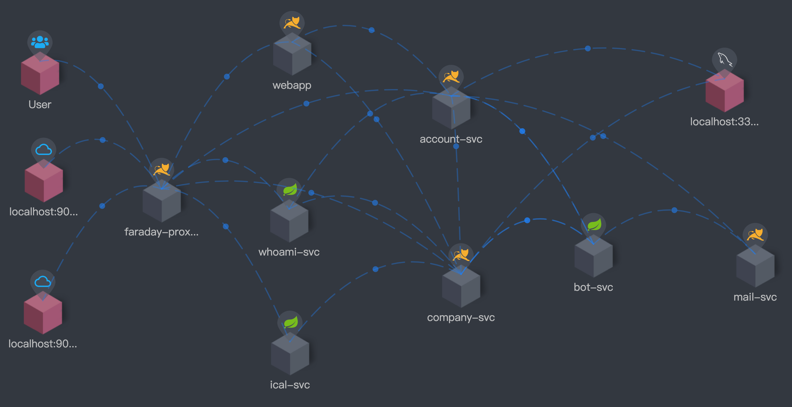
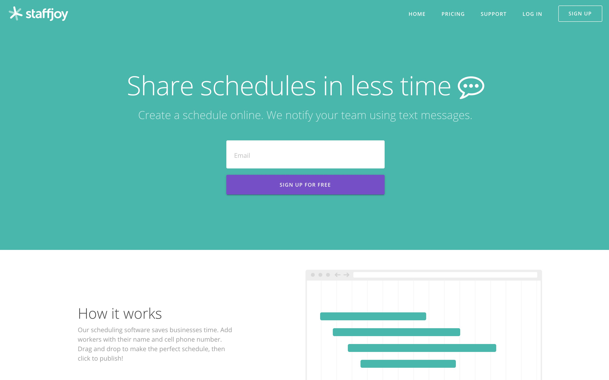
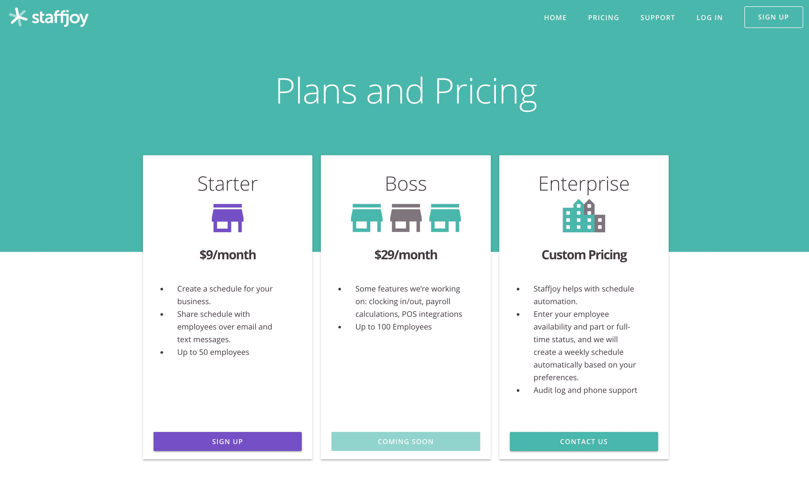
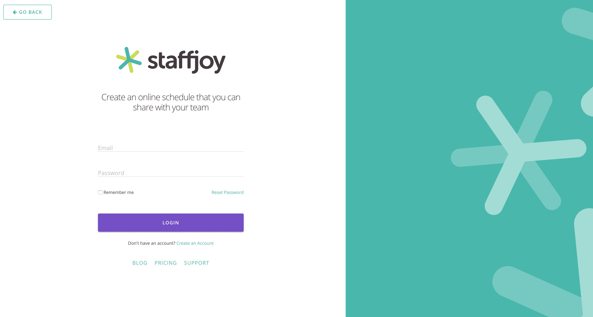
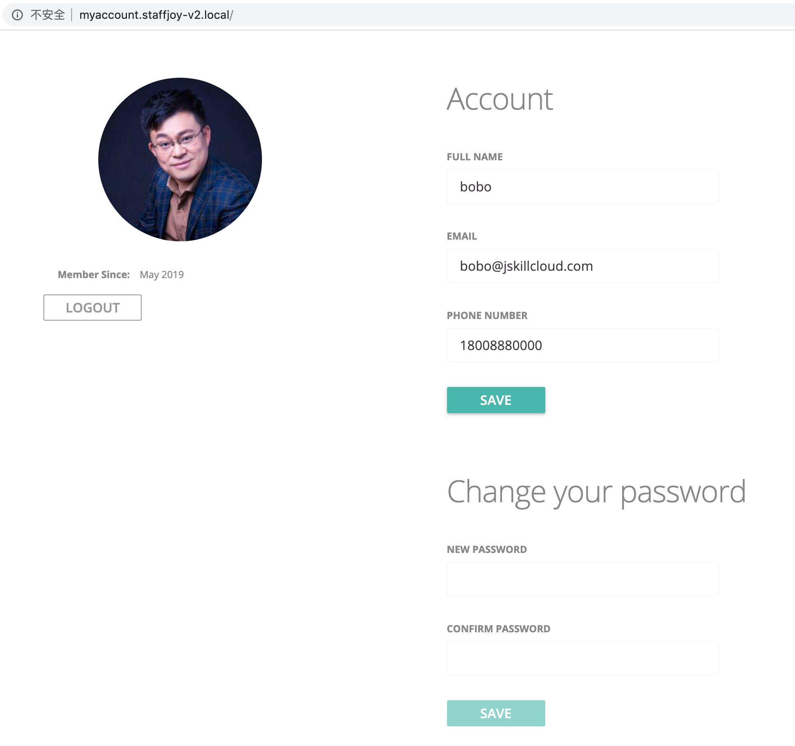
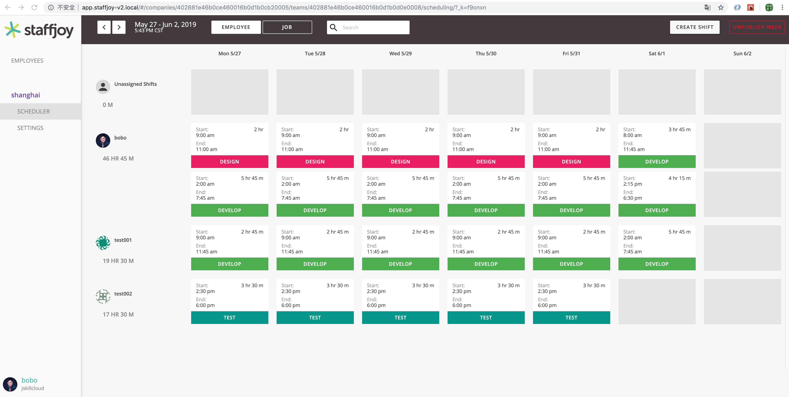

# Staffjoy 教学版

微服务和云原生架构教学案例项目，基于 Spring Boot 和 Kubernetes 技术栈

## 课程资料 PPT

1. 第 1 章 [课程介绍和案例需求](https://github.com/spring2go/staffjoy-ppt/blob/master/doc/ppts/Chapter_01.pdf)
2. 第 2 章 [系统架构设计和技术栈选型](https://github.com/spring2go/staffjoy-ppt/blob/master/doc/ppts/Chapter_02.pdf)
3. 第 3 章 [服务开发框架设计和实践](https://github.com/spring2go/staffjoy-ppt/blob/master/doc/ppts/Chapter_03.pdf)
4. 第 4 章 [可编程网关设计和实践](https://github.com/spring2go/staffjoy-ppt/blob/master/doc/ppts/Chapter_04.pdf)
5. 第 5 章 [安全框架设计和实践](https://github.com/spring2go/staffjoy-ppt/blob/master/doc/ppts/Chapter_05.pdf)
6. 第 6 章 [微服务测试设计和实践](https://github.com/spring2go/staffjoy-ppt/blob/master/doc/ppts/Chapter_06.pdf)
7. 第 7 章 [可运维架构设计和实践](https://github.com/spring2go/staffjoy-ppt/blob/master/doc/ppts/Chapter_07.pdf)
8. 第 8 章 [服务容器化和 Docker Compose 部署](https://github.com/spring2go/staffjoy-ppt/blob/master/doc/ppts/Chapter_08.pdf)
9. 第 9 章 [云原生架构和 Kubernetes 容器云部署](https://github.com/spring2go/staffjoy-ppt/blob/master/doc/ppts/Chapter_09.pdf)
10. 第 10 章 [项目复盘、扩展和应用](https://github.com/spring2go/staffjoy-ppt/blob/master/doc/ppts/Chapter_10.pdf)
11. 第 11 章 [附录：Staffjoy 微服务实现简析](https://github.com/spring2go/staffjoy-ppt/blob/master/doc/ppts/Chapter_11.pdf)
12. 附：[课程参考资料链接](doc/reference.md)

## 项目初衷

微服务和云原生架构是目前互联网行业的技术热点，相关资料文档很多，但是缺乏端到端的贴近生产的案例，这就使得很多互联网开发人员(包括架构师)，虽然学习了很多微服务理论，但是在真正落地实施微服务云原生架构的时候，仍然会感到困惑。为此，我利用业余时间，通过改造一个叫[Staffjoy](https://github.com/staffjoy/v2)的开源项目，开发了这个教学版的案例项目。整个项目采用微服务架构，并且可以一键部署到 Kubernetes 容器云环境。最近我和极客时间合作，基于这个案例项目开发了一门课程《Spring Boot 与 Kubernetes 云原生微服务实践 ～ 全面掌握云原生应用的架构设计与实现》，参考[课程大纲](doc/syllabus.md)。希望通过实际案例项目和课程的学习，让开发人员/架构师不仅能够深入理解微服务和云原生架构原理，同时能够在生产实践中真正地去落地实施微服务和云原生架构。也希望这个项目成为微服务云原生架构的一个参考模版，进一步可以作为类似项目的脚手架。

## 课程目标

通过具体案例的形式，教大家使用 SpringBoot 框架，开发一个贴近生产的微服务应用，并一键部署到 Kubernetes 容器云环境，帮助大家：

1. 掌握如何在实践中设计微服务架构和前后分离架构
2. 掌握如何基于 SpringBoot 搭建微服务基础框架
3. 掌握 SpringBoot 测试技术和相关实践
4. 掌握服务容器化和容器云部署相关实践
5. 进一步提升 Java/Spring 微服务开发技能
6. 理解可运维架构理念和相关实践
7. 理解如何架构和设计一个 SaaS 多租户应用
8. 理解云时代的 DevOps 工程实践

## 项目架构

- **Account API(账户服务)**，提供账户注册、登录认证和账户信息管理等基本功能。
- **Company API(公司服务)**，支持团队(Team)，雇员(Worker)，任务(Job）和班次(Shift)等核心领域概念的管理功能。
- **Bot API**，是一个消息转发服务，它一方面作为队列可以缓冲高峰期的大量通知消息，另一方面作为代理可以屏蔽将来可能的通知方式的变更。
- **Mail Sender 和 SMS Sender**，都是消息通知服务，分别支持邮件和短信通知方式，它们可以对接各种云服务，比如阿里云邮件或短信服务。
- **WhoAmI API**，支持前端应用获取当前登录用户的详情信息，包括公司和管理员身份，团队信息等，它也可以看作是一个用户会话(Session)信息服务。
- **App(也称 MyCompany)**，单页 SPA 应用，是整个 Staffjoy 应用的主界面，公司管理员通过它管理公司、雇员、任务和排班等信息。
- **MyAccount** ，单页 SPA 应用，它主要支持公司雇员管理个人信息，包括邮件和电话等，方便接收排班通知消息。
- **WWW 应用**， 是一个前端 MVC 应用，它主要支持产品营销、公司介绍和用户注册登录/登出，这个应用也称为营销站点(Marketing Site)或者登录页(Landing Page)应用。
- **Faraday(法拉弟)**，是一个反向代理(功能类似 nginx)，也可以看作是一个网关(功能类似 zuul)，它是用户访问 Staffjoy 微服务应用的流量入口，它既实现对前端应用和后端 API 的路由访问，也实现登录鉴权和访问控制等安全功能。Faraday 代理是 Staffjoy 微服务架构和前后分离架构的关键，并且它是唯一具有公网 IP 的服务。

Staffjoy 微服务间通讯，包括对外暴露 API，全部采用 JSON over HTTP 标准方式。

上图是经过调用链埋点监控后，在 Skywalking Dashboard 上实时呈现出来的服务依赖关系图，这个依赖图和总体架构设计保持一致。

## 项目技术栈

- Spring Boot
- Spring REST
- Spring Data JPA
- Spring MVC + Thymeleaf
- MySql
- ReactJs + Redux
- Docker Compose
- Kubernetes

Staffjoy 教学版所采用的技术栈都是目前行业主流，数量不多，如上面架构图所标示。所有微服务(绿色标注)采用**Spring REST**开发，有数据访问交互的采用**Spring Data JPA**，数据库使用**MySQL**。WWW 服务使用**Spring MVC+Thymeleaf**模版引擎开发。Faraday 也是一个**SpringBoot**应用，内部路由和安全等逻辑基于**Servlet Filter**实现。两个单页 SPA 应用(暗红色标注)都是采用**ReactJs+Redux**框架开发。整个应用支持一键部署到本地**Docker Compose**环境，也支持一键部署到**Kubernetes**容器云环境，所以 Staffjoy 的整体架构是支持云原生的微服务架构。

## 关于项目的进一步说明

1. 教学版 Staffjoy 和原版 Staffjoy 在功能、设计和实现逻辑上基本保持一致，但教学版在原版基础上做了一些改造，以适应教学需要。首先，在开发语言框架上，原版 Staffjoy 用 Golang/Grpc 实现微服务，教学版 Staffjoy 则改造为用国内更主流的 Spring(Boot)实现微服务；其次，在架构上，原版 Staffjoy 因为使用 Grpc 开发微服务，为了将 Rpc 服务暴露成 HTTP/REST 服务，它多一个对应的 Grpc API Gateway 转换层服务，而教学版 Staffjoy 因为使用 Spring(Boot)开发，直接支持 HTTP/REST 接口，所以不需要独立转换层服务；第三，原版 Staffjoy 默认使用 SMS 短信发送排班通知信息，但在国内开通短信服务需要审批，比较麻烦，所以在教学版 Staffjoy 中，排班通知默认调整为邮件方式，方便测试和演示。学习理解了 Spring(Boot)教学版 Staffjoy，很容易理解原版 Golang/Grpc 开发的 Staffjoy，对原版有兴趣的学员可以直接看官方[源码](https://github.com/Staffjoy/v2)。
2. 开发和运行教学版 Staffjoy，需要安装一些必要的开发工具(操作系统不限)，包括 JDK8，Maven 依赖管理工具，Intellij IDEA 或者 Eclipse STS IDE，MySQL 数据库和 MySQL Workbench 管理工具，Nodejs/npm 前端开发框架，Postman API 测试工具，以及 Docker 运行时环境。因为 Staffjoy 服务较多，如果要在本机跑，建议物理内存**不少于 8G**。
3. 教学版的 Staffjoy 虽然是一个较完整的 SaaS 应用，并且架构设计中考虑了很多生产性环节，但是它仍然只是一个教学演示项目，仅供学习参考，如果你要将它进行生产化应用(或者基于它的代码做其它项目的脚手架)，则仍然需要对其进行严格测试和定制扩展。大家在学习或使用教学版 Staffjoy 过程中，如果发现有 bug，或者对项目有完善扩展建议，欢迎提交 github issue.

## 如何运行

1. 配置文件

Staffjoy 教学版依赖一些私密配置，例如 sentry-dsn 和 aliyun-access-key 等等，这些私密配置不能 checkin 到 github 上，所以采用了 Spring 的一种私密配置机制，私密数据集中配置在**config/application.yml**中，这个文件在 gitignore 中，不会被 checkin 到 github。请参考 config 目录中的[application.yml.example](config/application.yml.example)文件和格式，在 config 目录中添加一个**appliction.yml**文件，其中填写你自己的私密配置。如果你暂时没有这些配置，可以暂时用假数据，直接把 application.yml.example，改为 application.yml，这样应用可以运行起来。注意，如果 aliyun 相关配置不配，则无法发送邮件或短信，sentry 相关配置不配则无法发送异常数据到 sentry，intercom 不配则不能对接 intercom 客服系统，recaptcha 暂未用可以不配。

**关于如何运行的进一步内容，请参考极客时间的视频课程，课程里头有step by step演示**。

### 注意!!!

Staffjoy 的 mail-svc 依赖于阿里云的邮件推送(DirectMail)发送邮件，不少学员反应运行时邮件发送不成功，实际配置阿里云 DirectMail 是比较麻烦的，有一个简单办法可以绕开：邮件发送不成功的话，会报异常日志，日志里头有邮件内容，比如账号注册邮件发不成功，可以从异常日志里头找到激活链接，把链接贴到浏览器中，就可以激活账号了。后续考虑简化 mail-svc，支持 smtp 等简单方式配置和发送邮件。

## Staffjoy 公司和案例背景

[Staffjoy](https://www.staffjoy.com/)曾经是美国硅谷的一家初创公司，成立于 2015 年，创始人是[Philip I. Thomas](https://www.linkedin.com/in/philipithomas/)，公司曾获得 Y Combinator 等知名机构的投资。Staffjoy 的主要业务是为小企业提供工时排班(Scheduling)软件解决方案，帮助企业提升雇员管理效率，主要面向零售、餐饮等服务行业。因业务发展和招聘等原因，[Staffjoy 公司最终于 2017 年关闭](https://blog.staffjoy.com/denouement-abe7d26f2de0)，在关闭前，公司把核心产品大部分都[开源](https://github.com/Staffjoy)贡献给了 Github 社区。[Staffjoy V2](https://github.com/Staffjoy/v2)是公司关闭前研发的最新一款 SaaS 版企业排班系统，目前在 Github 上有超过 1k 星，总体设计和代码质量较高，目前有不少企业在定制使用。Staffjoy V2 是一个小规模 SaaS 应用，采用微服务和前后分离架构，支持 Kubernetes/GKE 容器云环境一键部署，是学习现代 SaaS、微服务和云原生架构的一个模版项目。

## Staffjoy 应用的功能需求

Staffjoy 应用的业务功能相对简单，简单讲就是帮助小企业管理者管理雇员和排班，并以短信或者邮件等方式，将排班信息及时通知到雇员。具体讲，Staffjoy 主要支持两类用户角色和用例，一类是公司管理员(admin)，他们可以通过 Staffjoy 管理公司(company)、员工目录(directory)，团队(team)和雇员(worker)，也可以创建任务(job)，创建和发布班次(shift)信息；另一类是公司雇员，他们可以通过 Staffjoy 管理电话和邮件等个人信息，便于接收到对应的排班通知。Staffjoy 应用主要以共享版 SaaS 服务形式提供，也支持针对一些大客户的定制私有部署，这就要求 Staffjoy 应用易于部署和运维，要支持一键部署到 GKE 等容器云环境。另外，作为一款 SaaS 服务产品，良好的市场营销(Marketing)和客服是赢得用户的关键，所以 Staffjoy 需要提供营销友好的(Marketing Friendly)宣传和登录页(Landing Page)，也要支持对接主流的在线客服系统如 Intercom。

## 项目界面预览

### 1. 首页

### 2. 订购计划和价格页

### 3. 登录页

### 4. 雇员账户管理 SPA 单页应用

### 5. 我的公司 SPA 单页应用

## 其它可供参考微服务案例项目

- [eShopOnContainers](https://github.com/dotnet-architecture/eShopOnContainers) 微软支持
- [microservices-demo](https://github.com/GoogleCloudPlatform/microservices-demo) 谷歌支持
- [piggy-metrics](https://github.com/sqshq/piggymetrics)
